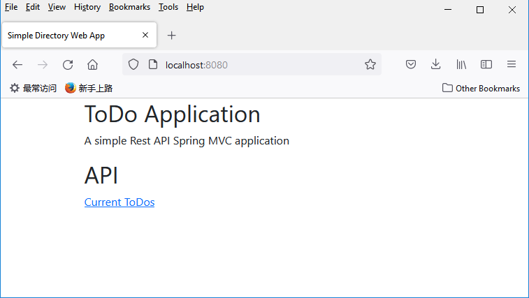
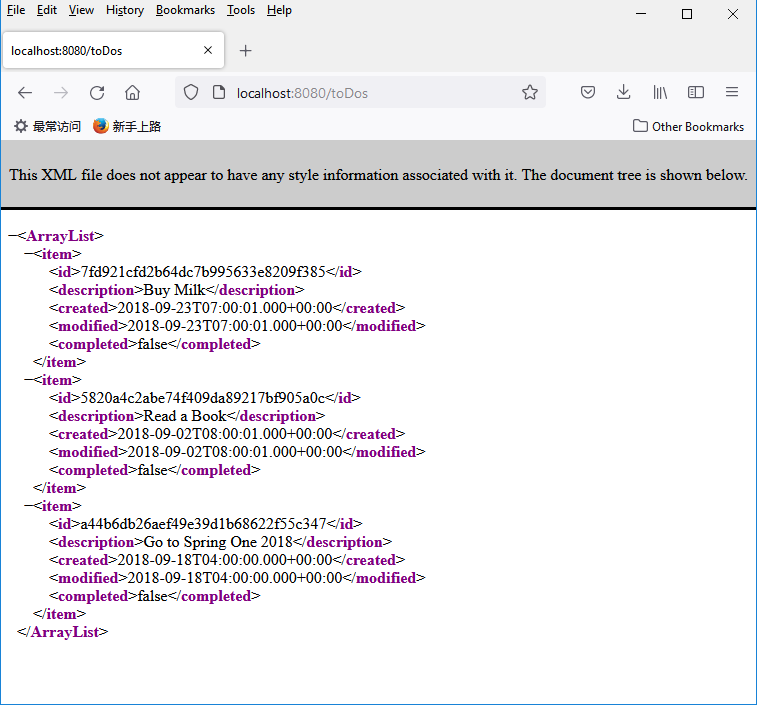

# CHAPTER 1, Spring Framework 5

## Changes to the source codes
- H2 database configured using application.properties
- Auot configuration using Spring Boot 2, but not xml
- Class TODO add an annotation @Table(name="TODO")
- ViewResolver changed to thymeleaf

## Screen Shots
### 1. http://localhost:8080/

### 2. http://localhost:8080/toDos

