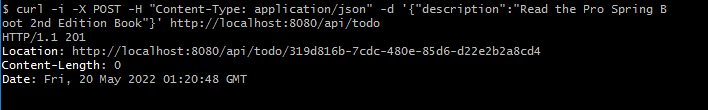

# CHAPTER 4, Web Applications with Spring Boot

## Remarks 
- main folder: Spring Boot Web RESTful API
- client subfolder: Spring Boot Web Client

## RESTful API
### 1. http://localhost:8080/api/todo

### 2. curl -i http://localhost:8080/api/todo

### 3. curl -i -X POST -H "Content-Type: application/json" -d '{"description":"Read the Pro Spring Boot 2nd Edition Book"}' http://localhost:8080/api/todo

### 4. curl -i -X PUT -H "Content-Type: application/json" -d '{"description":"Take the dog and the cat for a walk", "id":"2d051b67-7716-4ee6-9c45-1de939fa579f"}' http://localhost:8080/api/todo

### 5. curl -i -X PATCH http://localhost:8080/api/todo/f253e504-d2ed-4b4a-96db-f83463b85de2

### 6. curl -i -X DELETE http://localhost:8080/api/todo/f253e504-d2ed-4b4a-96db-f83463b85de2

### 7. curl -i -X POST -H "Content-Type: application/json" -d '{"description":""}' http://localhost:8080/api/todo

## RESTful API-Client
### 

