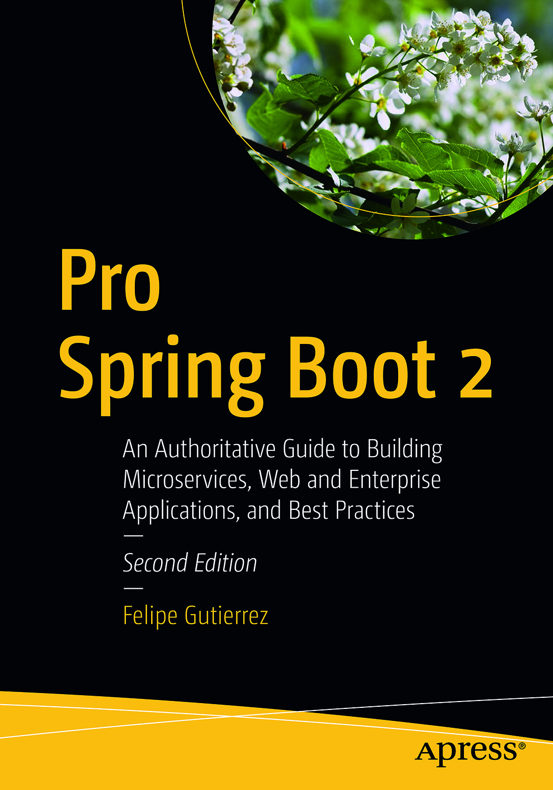

# Pro-Spring-Boot-2-Apress-Felipe-Gutierrez-2E
Pro Spring Boot 2/Second Edition/Felipe Gutierrez

## 2nd Edition, Apress  
### Felipe Gutierrez
 An Authoritative Guide to Building Microservices, Web and Enterprise Applications, and Best Practices

# Table of Contents
- [Chapter 01, Spring Framework 5](./Chap01_SpringFramework5)
- [Chapter 02, Introduction to Spring Boot](./Chap02_IntroductionToSpringBoot)
- [Chapter 03, Spring Boot Internals and Features](./Chap03_SpringBootInternalsandFeatures)
- [Chapter 04, Web Applications with Spring Boot](./Chap04_WebApplicationswithSpringBoot)
- [Chapter 05, Data Access with Spring Boot](./Chap05_DataAccesswithSpringBoot)
- [Chapter 06, WebFlux and Reactive Data with Spring Boot](./Chap06_WebFluxandReactiveDatawithSpringBoot)
- [Chapter 07, Testing with Spring Boot](./Chap07_TestingwithSpringBoot)
